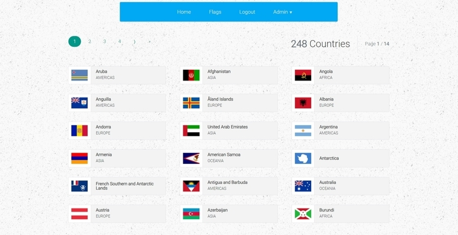

# React Flags

React+Redux app with user authentication, filtering & pagination.

This app is using a **Node.js** api server set up with **MongoDB** database deployed on [Heroku](https://react-flags-api.herokuapp.com).

## **[Demo](https://react-flags.herokuapp.com)**

## User Access

Admin account - email: `admin@test.com`. password: `password`

User account - email: `user@test.com`. password: `password`

The list of users are visible for admins. You can use any account from the list to log in. All of them have same password: `password`

## App Description

_I have added more functionalities than required to make it a little more interesting._

This app shows a list of flags of all nations (mostly). For this, it uses **countries-api** package. The flags are only visible to authenticated users, i.e users either logged in or registered.

For the admin, the app provides options for adding new user, updating or deleting existing user accounts. The app protects routes that requires authentication for both user & admin account.



## Tools Used (front-end)

- React, Redux, React-Router
- Additional packages: redux-thunk, axios, react-js-pagination

## Getting Started

The app uses api endpoints deployed to heroku. So, there is no need to set up the backend, although the server-side code is added here.

To run the app: clone the repo & install the dependencies

```shell
> git clone https://kukiron@bitbucket.org/kukiron/react-flags.git
> cd react-flags
> npm install
> npm start
```

Navigate to `localhost:3000` & you can start using the app immediately.

### Setup MongoDB & api-server locally

You need to install & configure [MongoDB](https://docs.mongodb.com/manual/installation/) before running the API server from local machine. After installing MongoDB, run `mongod` from terminal & edit the `index.js` file in the `server` folder:

```javascript
// change the following line
mongoose.connect(process.env.MONGODB_URI)

// to the following
mongoose.connect("mongodb://localhost:27017/db-name")
```

Then install the dependencies & start the server:

```shell
> npm install
> npm run dev:server
```

The server will be started on `localhost:3090`.

Now you are good to go! 🎉
